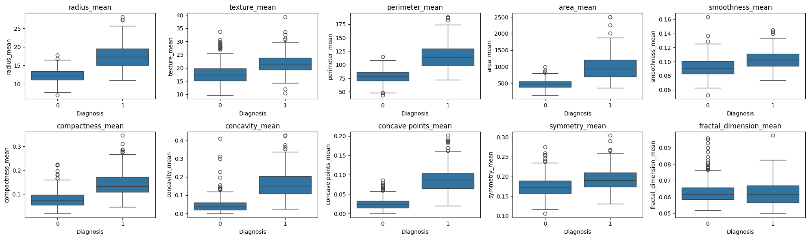
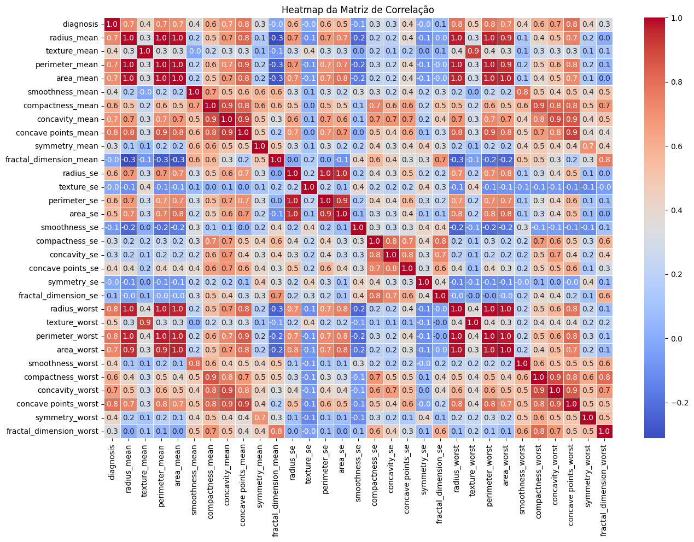

# Projeto de Análise de Dados e Machine Learning - Estudo Pessoal

Este projeto é uma iniciativa pessoal com o objetivo de aprimorar meus conhecimentos em análise de dados e machine learning. Através dele, exploro desde a análise exploratória de dados até a construção de um modelo preditivo, utilizando um conjunto de dados sobre o câncer de mama em Wisconsin.

## Dados Utilizados

Os dados são extraídos de um conjunto disponível no Kaggle, com informações sobre o câncer de mama em Wisconsin.  
[Acesse os dados aqui.](https://www.kaggle.com/datasets/uciml/breast-cancer-wisconsin-data/data)

---

## Fase 1: Análise Exploratória de Dados

Nesta fase, busco entender as variáveis do conjunto de dados, identificar valores nulos e analisar sua distribuição. Além disso, realizo a análise de correlação para identificar padrões e relações que podem ser importantes para o modelo.

### Visualizações Utilizadas
- **ScatterPlot e Boxplot**:  
  Para entender a distribuição e a relação entre as variáveis.
  
- **Mapa de Correlação (Heatmap)**:  
  Para explorar a intensidade das correlações entre as variáveis e o alvo.
  

---

## Fase 2: Validação Simples das Variáveis

Com base nas variáveis selecionadas, faço uma validação inicial do modelo usando o **Random Forest** para calcular métricas como **acurácia**, **precisão**, **recall** e gerar a **matriz de confusão**.

---

## Fase 3: Seleção e Validação das Variáveis

Utilizo técnicas como **RFE**, **SelectKBest** e **Feature Importance** para refinar as variáveis e melhorar o modelo. Com isso, aplico o algoritmo **Random Forest** para treinar o modelo e avaliar seu desempenho.

### Métodos de Avaliação:
- **Precisão** e **Recall**.
- **ROC AUC**.
- **Acurácia**.
- **Matriz de Confusão**.
- **Validação Cruzada**.

Além disso, este projeto inclui uma abordagem para **seleção automatizada de hiperparâmetros**, o que me ajuda a otimizar o desempenho do modelo.

---

Este é um projeto de aprendizado, com o intuito de expandir meu entendimento sobre análise de dados e machine learning, e não uma solução profissional. Estou no processo de aprimorar minhas habilidades por meio de prática e estudo contínuo.
